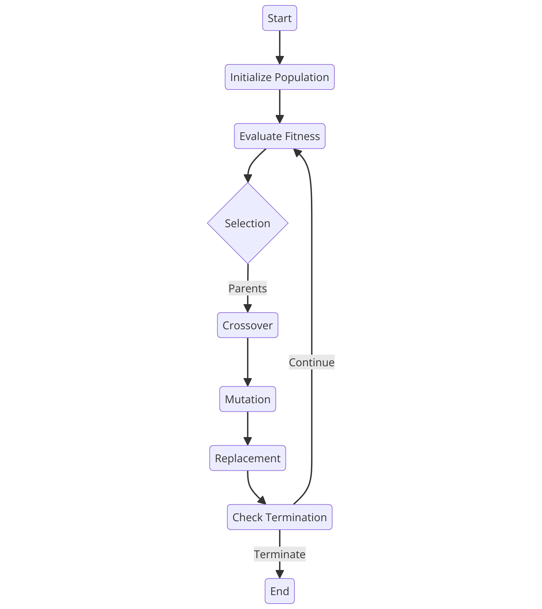

```@meta
CurrentModule = GeneticAlgorithm
```

# GeneticAlgorithm

A Julia package providing genetic algorithms for optimization. It provides diffrent implementation of mutation, recombination, crossover and selection functions.
Documentation for [GeneticAlgorithm](https://github.com/MaxHTu/GeneticAlgorithm.jl).

#### Important
> This package is build for the Julia Programming for Machine Learning course at TU Berlin and will will not be maintained afterwards.

## What is a Genetic Algorithm?

A [Genetic Algorithm](https://en.wikipedia.org/wiki/Genetic_algorithm) is a technique based on natural evolution and genetics. It solves constrained and unconstrained optimization problems in which traditional algorithms and methods might struggle. It is part of the class of evolutionary algorithms.

The following chart shows the basic steps of a Genetic Algorithm:




## Getting started
The package can be installed with the Julia package manager. From the Julia REPL, type ] to enter the Pkg REPL mode and run:

```
] add https://github.com/MaxHTu/GeneticAlgorithm.jl
```

This is a simple example unsing a genetic algorithm to solve he [Rosenbrock function](https://en.wikipedia.org/wiki/Rosenbrock_function).

```julia
using GeneticAlgorithm
genAlgo(50, true, 2, rosenbrock, 50, 0.25, 0.1)
```

```@index
```

```@autodocs
Modules = [GeneticAlgorithm]
```
